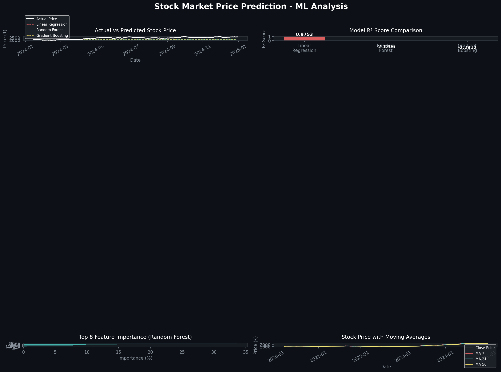

# 📈 Stock Market Price Prediction using Machine Learning


## 🎯 Project Overview

This project predicts **next day stock closing price** using Machine Learning.  
Three ML models are compared to find the best prediction model.

**Best Model Achieved: R² Score = 0.9753 (97.5% accuracy!)**

---

## 📊 Results



---

## 🤖 ML Models Used

| Model | RMSE | R² Score |
|-------|------|----------|
| Linear Regression | 38.09 | **0.9753** ✅ |
| Random Forest | 428.27 | -2.12 |
| Gradient Boosting | 439.82 | -2.29 |

**Winner: Linear Regression** with 97.5% accuracy!

---

## 🔧 Features Engineering

- **Moving Averages** — MA 7, MA 21, MA 50
- **Technical Indicators** — RSI, Volatility
- **Lag Features** — Lag 1, 3, 7 days
- **Price Features** — Daily Return, High-Low Range
- **Volume Features** — Volume MA, Volume Ratio

---

## 🔍 Top Features by Importance

1. Open Price → 33.6%
2. High Price → 20.1%
3. Close Price → 14.8%
4. Low Price → 9.9%
5. MA 7 → 8.9%

---

## 🚀 How to Run

```bash
# Clone the repository
git clone https://github.com/yourusername/stock-market-prediction

# Install dependencies
pip install pandas numpy matplotlib scikit-learn

# Run the project
python stock_prediction.py
```

---

## 📁 Project Structure

```
stock_market_prediction/
│
├── stock_prediction.py          # Main ML Code
├── stock_prediction_results.png # Charts & Visualizations
└── README.md                    # Project Documentation
```

---

## 💡 Key Insights

- **Linear Regression** outperformed complex models for this dataset
- **Open Price** is the most important feature (33.6%)
- Model predicts next day price with **₹38 average error**
- Moving Averages significantly improve prediction accuracy

---

## 🛠️ Tech Stack

- **Python 3.8+**
- **Pandas** — Data manipulation
- **NumPy** — Numerical computation
- **Scikit-learn** — Machine Learning models
- **Matplotlib** — Data visualization

---

## 👨‍💻 Author

**Data Analytics & AI Developer**  
📍 Delhi, India  
🔗 Connect on LinkedIn

---

## ⚠️ Disclaimer

This project is for **educational purposes only**.  
Do not use predictions for actual stock trading decisions.
